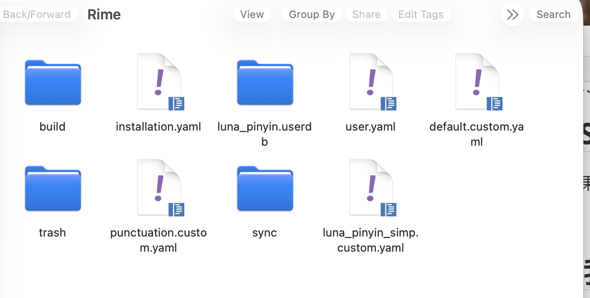
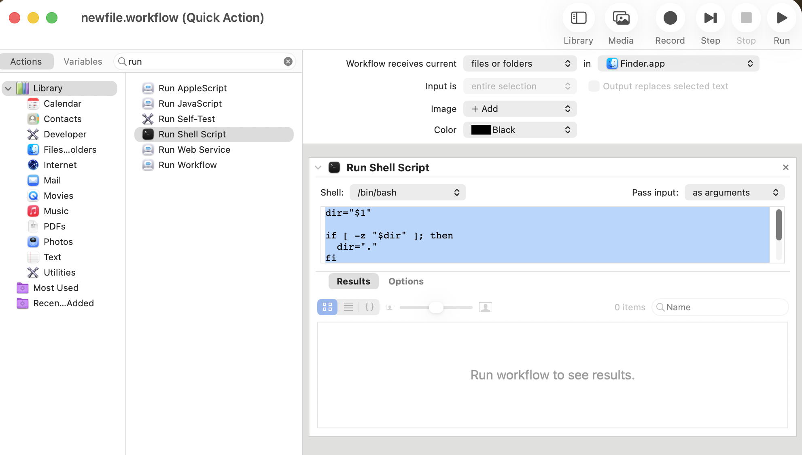

macOS. 非常优秀的一个系统, 但是也是非常多恶心的原生设置. 

## iCloud Sync

首先当然用苹果系肯定要用 iCloud. 不然用它干嘛.


## 输入法: 我推荐 Rime

最大的原因是. 苹果系统的中文 inputsource pinyin, 虽然支持全部用英文标点, 但是居然是不完全的. 就我而言, 最关键的: 一个是$, 一个是\, 一个是 {}, Latex 必开的默认英文标点, 居然没有被覆盖到. 而且这个 inputsource 完全不可以自定义.

我做过另一个尝试: 就是用一个叫 Karabiner 的软件全局拦截输入并修改. 但是问题是它的连续行为是异步的, 首先指令之间自己得设置挺大的延迟, 其次还会受到系统级的拦截限制. 比如我把 shift+4 设置为: 切换到英文输入, 重新打一遍, 再切换回中文输入. 结果每次当输入 enter /space 之后, 这个自定义行为都会因为系统的高权限拦截被 disable 掉. 

所以我的做法是用一个挺不错的开源 inputsource. 真心比系统自带的好. 

https://rime.im/download/



### 加 emoji 库

但这个下载是不包括 emoji 库的. 我们需要自己额外下载一个 emoji 库. 

```json
mkdir -p ~/Library/Rime/opencc

curl -L -o ~/Library/Rime/opencc/emoji.json \
  https://raw.githubusercontent.com/rime-aca/OpenCC_Emoji/master/opencc/emoji.json

curl -L -o ~/Library/Rime/opencc/emoji_word.txt \
  https://raw.githubusercontent.com/rime-aca/OpenCC_Emoji/master/opencc/emoji_word.txt

curl -L -o ~/Library/Rime/opencc/emoji_category.txt \
  https://raw.githubusercontent.com/rime-aca/OpenCC_Emoji/master/opencc/emoji_category.txt

```

下载结果大概是:

```bash
  % Total    % Received % Xferd  Average Speed   Time    Time     Time  Current
                                 Dload  Upload   Total   Spent    Left  Speed
100   382  100   382    0     0   2515      0 --:--:-- --:--:-- --:--:--  2529
  % Total    % Received % Xferd  Average Speed   Time    Time     Time  Current
                                 Dload  Upload   Total   Spent    Left  Speed
100  179k  100  179k    0     0   526k      0 --:--:-- --:--:-- --:--:--  525k
  % Total    % Received % Xferd  Average Speed   Time    Time     Time  Current
                                 Dload  Upload   Total   Spent    Left  Speed
100 15747  100 15747    0     0  74956      0 --:--:-- --:--:-- --:--:-- 75344
```

### `luna_pinyin_simp.custom.yaml`

下载完之后自动重启, 打开 settings 就是进入这个文件夹. 只需要创建一个 `luna_pinyin_simp.custom.yaml` 文件然后输入

```yaml
patch:
  menu:
    page_size: 6

  punctuator:
    full_shape: false

  engine/filters:
    - simplifier
    - simplifier@emoji_suggestion

  simplifier:
    opencc_config: t2s.json
    tips: none

  emoji_suggestion:
    opencc_config: emoji.json
    option_name: emoji_suggestion
    tips: none

  switches:
    - name: emoji_suggestion
      reset: 1
      states: [ Off, Emoji ]
    - name: simplification
      reset: 1
      states: [汉字, 漢字]


  key_binder/bindings:
    - { when: always, accept: Control+Shift+4, send: noop }
    - { when: always, accept: Control+Shift+dollar, send: noop }

  reverse_lookup:
    enable: false

  recognizer/patterns:
    reverse_lookup: "a^"  

```

就好了.

其他设置也可以改. 自定义支持度非常高. 我这里加了 emoji filter.


### `squirrel.custom.yaml` 

刚才我们定义的是 schema (输入方案层), 使用

- `luna_pinyin_simp.schema.yaml`
- `luna_pinyin_simp.custom.yaml`

负责:

- 拼写规则
- 词典
- translator
- recognizer
- key_binder
- engine pipeline

它不负责 UI 展示. UI 展示, 比如 layout 是横的还是竖着的, 是 `squirrel.custom.yaml` 里面自定义.

所以在这个目录再创建一个这个文件. 

我这里定义了 layout 改成竖的.

```yaml
patch:
  "style/candidate_list_layout": linear
  "style/text_orientation": horizontal
```


### 把 input sources 的 caplock 键切换 input source 给去掉. 

system settings -> keyboard -> input sources -> all input sources -> use the 中/英 key to switch to and from ABC

去掉之后它就变成了真正的大写键. 

本来的系统方案是需要它的, 但是我们现在用 rime 输入法, shift 恢复了切换中英文的功能, 于是就不再需要了. 现在恢复它原本的功能. 于是这个键盘就和 windows 的差不多了.


## 新建 workflow: 在 finder 中创建文件

这个真的是最傻比的一个事情. 我不知道为什么 macOS 不支持右键新建文件. 以至于每次都要从 terminal 里面 touch, 或者 `code .` 然后在 VSCode 里面创建. 这真的挺脑残的.

有一个办法, 虽然治标不治本 (finder 空白处不能 quick action, 只能对其中的文件夹进行 quick action), 但是起码好一点. 

就是新建一个 workflow, 支持 quick action 创建一个新的空白文件.

- fn+space 打开 automater.app, 新建一个 workflow -> quick action

- 选择 run shell script, 参数: workflow receive current `files or folders` in `Finder.app`, 然后 shell 选择 `bin/bash`, pass input `as arguments`, 输入这段 shell 文字

  ```bash
  dir="$1"
  
  if [ -z "$dir" ]; then
    dir="."
  fi
  
  touch "$dir/untitled.txt"
  ```



- 最后, cmd + S 保存 workflow. 

- 现在就可以右键一个文件夹创建新文件了

  


## 壁纸: 我推荐 Backdrop

买断制. 4k 动图壁纸库. 类似于 Wallpaper Engine, 虽然壁纸数量和社区远不如之, 但是真的是 mac 为数不多的正经的壁纸库软件了. 


## shell: fish; terminal: iTerm2

fish 是我个人喜好. 

iTerm2 是普遍认为的 mac 最好的 terminal 之一. 可定制性高.


## 一个改动: 把 Fn 映射到 cmd

这是因为 Fn 的键盘位置和 Windows 的 Ctrl 是一样的. 而 mac 的复制粘贴是 command+c/v. 这样用起来顺手一点 (因人而异)

改键位置: Setting -> Keyboard -> Set Up Keyboard


## finder 显示隐藏文件

Finder 中显示隐藏文件

```bash
defaults write com.apple.finder AppleShowAllFiles -bool true
killall Finder
```

