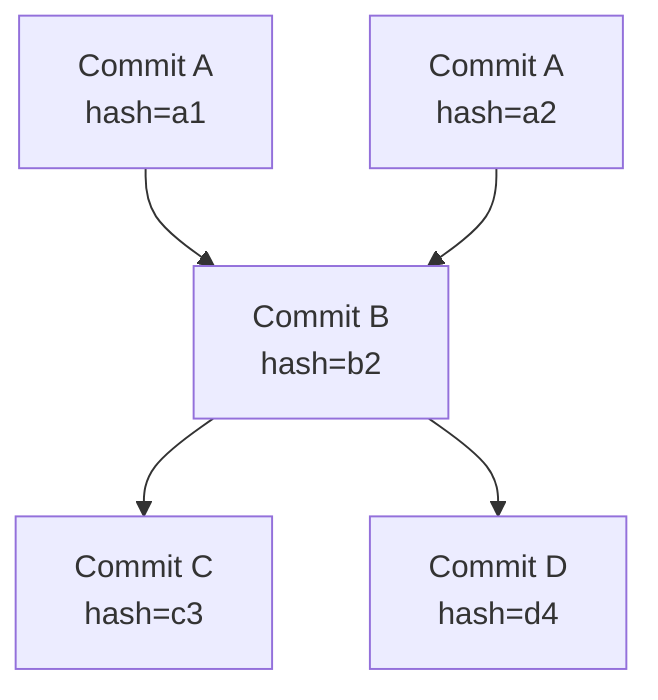
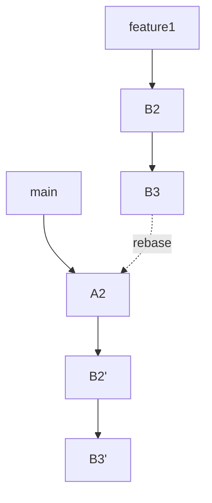
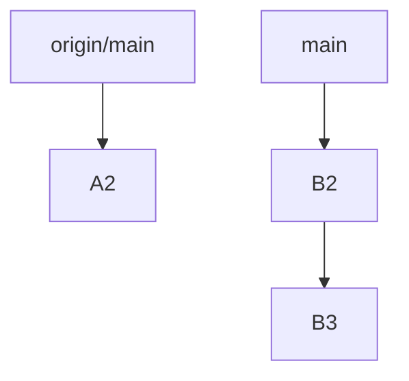

# Git

## `.git` 的组成

我们已经使用了很久 git 了,, 但是 barely 知道它的实现原理, 只模糊地知道它的用途

所以我认真地 (指使用 gpt) 学习了一下 git 的原理

Git 本质上是一个分布式的 Content-Addressable File System.

这里的 "Content-Addressable" 中的 Content, 注意并非是文件的 Content, 而是指 git 系统给一个 commit 赋的 HASH 值.

首先我们看到最大, 最外层的 `.git` 文件夹:

.git 由以下的 files 和 sub directory 组成:

| 文件/目录     | 说明                                                         |
| ------------- | ------------------------------------------------------------ |
| `HEAD`        | 记录当前检出的是哪个分支（通常指向 `refs/heads/main`）或某个 commit（在 detached HEAD 状态下） |
| `config`      | 仓库级别的配置文件，类似于 `git config --local` 设置的内容   |
| `description` | 给 GitWeb 用的仓库描述，平时用不到                           |
| `index`       | 暂存区（staging area）的快照信息，用于记录哪些文件准备提交   |
| `objects/`    | 所有 Git 对象（blob、tree、commit、tag）的实际存储地         |
| `refs/`       | 引用目录，保存指向各个 commit 的分支、tag 信息               |
| `hooks/`      | Git 钩子脚本目录，如 pre-commit、post-commit，支持自定义行为 |
| `logs/`       | 每次引用（HEAD、分支）变化的日志，可用于 `git reflog`        |
| `info/`       | 存储一些辅助信息，比如 `.git/info/exclude` 是局部忽略文件列表 |
| `packed-refs` | Git 会把部分 refs（分支/标签）打包存储在这里，提升查找效率   |


### `.git/objects/`

我们很容易发现, 最核心的部分就是里面的 `/objects/` 这个 sub directory. 这个 subdirectory 储存了各种核心 objects. 其结构是:

```shell
.git/objects/
├── 01/
│   └── abcd...    # 一个对象，其 SHA-1 哈希是 01abcd...
├── 3f/
│   └── 94ef...
└── info
```

这些对象本质上都是通过 zlib 压缩的二进制数据，可以用命令查看：

```shell
git log --pretty=raw
git cat-file -p <hash>
```

而 objects 中, 包含以下的类型:

|    类型     |                          描述                          |
| :---------: | :----------------------------------------------------: |
|  **Blob**   |     存储文件内容 (binary large object), 不带文件名     |
|  **Trees**  | 存储目录结构（包括文件名、权限和 blob 或 tree 的引用） |
| **Commits** |     快照，记录 Tree 指针、父 Commit、作者等元信息      |
|  **Tags**   |              可选，给某个 commit 加上标签              |

#### edit, `add`, `commit` files 后, 新 objects 的生成

每次我们修改文件并 `git add` 它, git 都会计算新的 SHA-1 hash (比如 `abc123...`), 并对应地创建新的 blob; 用暂存区 (index) 记录新的 blob.

可以用以下的命令查看当前文件的 blob hash:

```shell
git hash-object myfile.txt           # 计算该文件的 blob 哈希
git cat-file -p <blob_hash>         # 查看该 blob 对象的真实内容
```

而 `git commit` 时, git 会创建一个新的 tree (目录结构, 把文件名映射到新的 SHA-1 hash)


比如说, 你只有一个文件 `hello.txt`, 内容是 `Hello Git!`, 那么当我们 add, commit 后, git 的对象构成如下：

```shell
复制编辑
[blob]         存 "Hello Git!"
   ↑
[tree]         记录 hello.txt → blob 的映射
   ↑
[commit]       指向 tree，表示这个版本的快照
```

其中

- **内容（blob）** 存的是 `"Hello Git!"`
- **结构（tree）** 存的是 `"hello.txt → blob_hash"`
- **快照（commit）** 存的是 `"tree_hash + parent_hash + message"`

git 查找文件的顺序, 就是 commit → tree → (子 tree)* → blob.


#### trees

Notice: tree 的目的就是对各个文件夹的相对位置做一个记录以方便从 commit 到 blob 的映射.

为什么不直接使用 commit 到 blob 的映射, 而要用 tree 在中间过渡呢? 因为文件结构可能会很复杂. tree 的存在就像是文件系统的多级 page table, 让查找更加快速并且节省了冗长的目录路径名.  tree 提供了：

- 结构清晰的分层管理
- 可重用性（相同目录结构只存一份）
- 增量更新（某个子目录有变，只需创建新的子 tree）
- 快速 diff（两个 tree 相同就意味着整个子目录一致）

比如项目中的 `src/models/resnet.py` 被改了, 那么只有`resnet.py` 对应的 blob 更新, `models/...` 对应的 tree, `src/...` 对应的 tree 以及 root tree 更新, Git 只需存这些更新部分, 而其他 tree 不变可复用.

我们可以查看 tree 的数量:

```shell
git cat-file --batch-check --batch-all-objects | grep tree | wc -l
```


#### commits

可以将一个 commit 看作:

```c
struct Commit {
    Tree snapshot;
    Commit[] parents;
    Metadata { author, committer, message, timestamp };
}
```

可以用 `git cat-file -p <commit_hash>` 来查看 commit 的具体内容, 比如:

```shell
git cat-file -p 17c2b8a
```

输出可能如下:

```shell
tree e68f7d18b1c442a3f5044ef8aa335d2bd7e9c3f4
parent 98d3a2bc8976e3fd60f4129c97a2c84d3b9a2451
author Qiulin Fan <rynnefan@umich.com> 1715671234 +0800
committer Qiulin Fan <rynnefan@umich.com> 1715671234 +0800

add initial model training script
```


Commit 和 Tree 的连接关系（结构图）

```shell
graph TD
  C1[Commit 1]
  C2[Commit 2]
  C3[Commit 3]
  T1[Tree 1]
  T2[Tree 2]
  T3[Tree 3]
  C1 --> T1
  C2 --> T2
  C3 --> T3
  C2 --> C1
  C3 --> C2
```

每个 commit 指向一个 tree (项目状态), 并且指向一个或多个 parent (历史).


#### blobs

比起 commit, tree 和其他 objects 都是结构性的信息, blobs 则是我们更改的原始文件的内容, 是 .git 中最大的 objects.

每次我们修改并 `add` 一个文件, 都会生成新的 blob, 其存储了更改完的这一整个文件.

没错. 如果这个文件大小有 10 个 G, 那么每次我们 `add` 新的它, 都会生成一个 10 个 G 的 binary copy. 如果我们 `add`, `commit` 了它 10 次, 每次哪怕都只修改一点点, 那么我们的 `.git` 就会增加 50 个 G.

所以 git 对于处理大型文件是很 memory costly 的. 为了解决这个文件问题, git 提供 

1. **对象压缩与增量存储（Packfile 和 Delta Compression）**

	Git 会定期将多个对象打包成一个 packfile，并对其中的对象进行增量压缩（delta compression）

	对于相似的文件版本，Git 会存储它们之间的差异（delta），而不是完整的文件内容。

2. **Git LFS（Large File Storage）**

	Git 提供了 Git LFS 扩展, 将大文件的实际内容存储在外部服务器上, 而在 Git 仓库中只保留一个指向该文件的指针文件. 

	使用 Git LFS 后，每次提交修改后的 `a.txt`，Git 仓库中只会增加一个小的指针文件，而不是整个文件内容. 


### `.git/refs/`

目前为止, 我们讲解了 objects, 其主要就是阐释了 git 如何进行版本追踪. 其实很朴素.

但是我们记得: git 还有 "分支" 这一要素. 并且, 分支是分为本地和远程的. 这是它作为分布式 VCS 的根基: 通过本地和远程的分支的分布式交互, 实现分布式版本控制.

这一部分, 核心就在于 `.git/refs/` 这个子目录. 它是 git 的引用系统

它的结构如下:

```
.git/
└── refs/
    ├── heads/       # 所有本地分支的引用（本地分支）
    ├── remotes/     # 所有远程分支的引用（远程分支）
    └── tags/        # 所有标签的引用（轻量标签）
```

其有三个明确的子目录. 作用如下:

| 子目录               | 说明                                                         |
| -------------------- | ------------------------------------------------------------ |
| `.git/refs/heads/`   | 存放你所有**本地分支**的引用。例如 `main`, `dev`, `feature-x` 等。每个文件里面是一串 commit 哈希。 |
| `.git/refs/remotes/` | 存放你所有**远程分支**的引用，例如 `origin/main`、`origin/dev`。这些是远程仓库的追踪分支。 |
| `.git/refs/tags/`    | 存放所有**轻量标签**（lightweight tag）的引用。每个标签指向一个 commit。 |

因而更具体的结构例子如下:

```shell
.git/refs/
├── heads/
│   ├── main         # 本地 main 分支指向某 commit 哈希
│   └── dev
├── remotes/
│   └── origin/
│       ├── main     # 远程 origin/main 分支
│       └── dev
└── tags/
    └── v1.0         # 标签 v1.0 指向某个 commit
```

最核心的 Note: 

1. refs 本质上是 mutable pointer, 是随着我们在这个分支上的 commit 实时更新的. **每当我们在这个分支上 make 一个新 commit, 这个分支的 ref 就会指向这个新的 commit.**
2. **heads, remotes, tags 中的所有文件的内容, 全部都只是一个 40 字符的 commit hash 罢了.**

例如:

```shell
cat .git/refs/heads/main
8f937e0e5ad74b3c68bce5e4c1cf013c91c361e
```

从而 git 的 branching 信息, 其储存地就是这个 refs 文件夹. 那么表示 "当前我们到底在哪个分支上" 的 pointer 是什么呢? 就是 `.git/HEAD` 这个重要文件. 


### `.git/HEAD`

另一个重要的文件, 就是 HEAD. 

`HEAD` 表示了我们目前在 git 状态是在哪个 commit 上 (本地).

```shell
cat .git/HEAD
```

常见输出是：

```shell
ref: refs/heads/main
```

这意味着：

- `HEAD` → `refs/heads/main`

以下为 refs 和 HEAD 这两部分的总结:

|          问题          |                          回答                          |
| :--------------------: | :----------------------------------------------------: |
| Git 如何分辨一个分支？ | 查看 `.git/refs/heads/` 中的文件名，这些就是本地分支名 |
|    分支本质是什么？    |       一个指向 commit 的引用文件，内容是一个哈希       |
|    分支切换的原理？    |       修改 `.git/HEAD` 的指向，并切换工作区快照        |


以上, 我们比较精细地讲解了 `.git` 的具体内容, 是三个主要板块 (还有一个重要的, `index`, 表示暂存区, 不过我们在 objects 中也说明了它的作用, 不过多赘述). 


Git 对文件的版本历史进行管理, 可以**抽象化为一系列的 nodes 组成的有向无环图 (nodes 之间通过 parent 关系构成版本历史, 一个 node 可以有多个 parents 故非树)**, 其**每个 node 表示一个 commit 以及其更改的文件信息 (tree, blob), 以一个 hash 值为标签**. 

例如:



可以用  `git log --graph` 可视化 Git 的历史结构:

```shell
git log --oneline --graph --all
```


于此我们不禁会产生以下的疑问:

1. 如何切换 node (恢复 working directory 到某个版本)? 切换到先前的某个 ancestor node 之后, 它的子 nodes 何如?
2. 更改了一个 node 后, 它的子 nodes 何如?
3. 如何连接本地和远程的 nodes?
4. 本地和远程进行连接与信息交互后, 如何处理冲突?

这也就是关于 git, 我们关心的核心问题. 

而这四个问题的回答都是非常乐观的. 


## branching: how, 主动与被动

remember 以下两条铁律:

1. 所谓的一个 branch, 就是一个 commit 的 hash 所代表的 node.

	(Notice: branch root, 即某 branch 的第一个 commit, 是一个历史概念, 它在 Git 的结构中没有特殊的指针. 一个 branch 的 ref 不会指向 root, 除非我们 checkout 到那个 root commit 本身, in which case 我们会进入 detached HEAD 状态. **一个 branch 的 ref, 永远是其上最新的一次 commit 的 hash.**)

	**所谓 branching, 即把一个新的 ref 可变指针指向某个 commit node, 并对这个新 ref 命名.** 

2. **commit 不可修改**, 即每个 node 是 immutable 的  (因而我们永远不会去改变一个 commit node, 只会在其后建立新 nodes).

3. 任意已命名分支上的 node 永远不会被 git 主动 dispose

因而我们 "切换到先前的某个 ancestor node 之后, 它的子 nodes 何如" 的问题完全不用担心. branching 的行为本质上是选定一个任意的 ancestor 作为 root, 而之后的 commits 会在这个 root 后 (独立于其他 branches) 的一个新的 branch 上. 

### branching = 切换 HEAD 至 commit node + 命名新 ref

这就是 git branching 的基本法则. **Branching = 切换 HEAD 至 commit node + 命名新 ref**

因而 branching 的命令即:

```shell
git checkout -b new-branch-name <some_old_commit_hash>
```

New branch 的 root 就是这个 old commit (我们可能会好奇 git 如何区分一个 node 作为 root 的多个 branches, 但是其实就是直接用不同的 ref names 区分).

(for old commit hash, 可以先用 `git log` 查询)

或者可以拆成两步执行: switch + name

```shell
git switch --detach <some_old_commit>
# commit...
git branch new-branch-name     # 保存它
```

这里的 switch 就是把 HEAD 移动到某个 commit 上. 之后新 commit 会在这个 root commit 之后. 而如果我们不对其进行命名, 它就会成为一个 unamed branch; 命名则开创新 branch

unnamed branch 

### 只切换 node 不命名: 匿名分支 (unnamed branch) + detached HEAD 状态

有时候我们可能会粗心 (亦或故意地) 只切换 commit node, 但却不给它命名:

```shell
git checkout <commit_hash> # 或 git switch --detach <old_commit_hash>, 这是等价的
```

这就制造了一个 unnamed branch.

unamed branch 在未再次切换 branch 时, 是有效的; 但是一旦再次切换 branch, 它就会被孤立 (新的 commit 成为 **dangling commit**). 

被孤立的 unamed branch 在一段时间后会被 git 自动 dispose. 因为 Git 的垃圾回收（GC）机制只保留被引用的 commit 及其前的 commits.

补救的方式是在这个 branch (最新的 commit) 被清理掉前, 切回这个最新的 commit, 并命名它.

```shell
git branch ...
```


## Local branches 的交互操作: rebase 和 merge

### rebase

git rebase 是 Git 中一个非常重要的命令，它的作用是改变一组提交（commits）的“base”，从而实现更干净、更 linear 的提交历史.

简单而言 git rebase 就是把一串提交搬到另一串提交之后.

example:

假设你有如下提交历史：

```
A---B---C        (main)
         \
          D---E  (feature)
```

现在你在 feature 分支做了两个提交 D 和 E，而 main 分支有新提交 C。你希望把 feature 的工作搬到 C 之后，这时候用：

```
git checkout feature
git rebase main
```

结果变成：

```
A---B---C        (main)
             \
              D'--E'  (feature)
```

注意：D 和 E 被复制成了 D’ 和 E’（新的 commit id），因为 Git 是基于快照的系统，rebase 是 复制然后重放（replay） 的过程。


使用场景:

1. 保持提交历史整洁. 
2. 解决分支滞后的问题: 自己的分支落后于主分支，希望在主分支最新版本上继续开发


#### 整理提交顺序（用 git rebase -i）


- 交互式 rebase 可用于 squash、改 commit message、删除多余提交等。


#### 注意事项


1. 不要对已经共享的分支（比如已经 push 到 GitHub 上的）做 rebase！

	

	- 因为 rebase 会改变 commit ID，容易造成别人的历史失效和冲突。
	- 如果你真的要对远程 rebase，记得加 --force 强推。

	

2. 和 git merge 的区别：

	

	- merge 保留原历史（有一个额外的 merge commit）；
	- rebase 改写历史，使历史看起来更像一条直线。

	


| 命令       | 结果                         | 是否改历史 |
| ---------- | ---------------------------- | ---------- |
| git merge  | 合并两个分支，保留合并点     | 否         |
| git rebase | 复制提交并接到最新的提交之后 | 是         |


#### Git 的原则是：**commit 不可修改**，每个 node 是 immutable 的。

因此：

- 你“修改”一个 node，其实是创建一个新的 commit
- 所有后继子 node 的哈希都会改变（因为 parent 哈希变了）
- 会形成**新的 DAG 分支路径**


📌 举例：你 rebase 一个分支

```bash
git rebase main
```

Git 会：

- 把当前分支上的多个 commit 复制（不是移动）
- 将每个 commit 重新套在 `main` 的最后一个 commit 上
- 形成一组新的 commits，旧的节点不删除但默认“脱轨”



📌 总结

| 更改某个 node   | Git 会怎么做                           |
| --------------- | -------------------------------------- |
| 修改老的 commit | ❌ 不允许直接改动                       |
| rebase / amend  | ✅ 会复制新的 node，形成新路径          |
| 子节点如何？    | 原路径的子节点不变；新的 commit 是新路 |


### merge and conflict

git merge 是 Git 中的一个核心命令，用于将两个分支的历史合并在一起。它通常用于将一个分支上的修改合并到当前分支中。

 基本语法:

```
git merge <branch-name>
```

意思是：将 <branch-name> 分支的改动合并到当前所在分支中。


假设你有两个分支：

- main
- feature

你在 feature 分支上做了一些修改。现在想把这些修改合并到 main 上：

```
git checkout main        # 切换回 main 分支
git merge feature        # 将 feature 分支的修改合并到 main 上
```


🧠 工作机制简介:

1. Fast-forward 合并（快进式合并）：

	- 如果当前分支落后于目标分支，并且没有额外提交，Git 会直接把当前分支的指针“快进”到目标分支。
	- 不会产生新的 merge commit。

2. 三方合并（3-way merge）：

	- 如果两个分支各自有不同的提交（比如两个方向都发展了），Git 会找到共同祖先，做一次三方合并。
	- 会产生一个新的 merge commit 来记录两个历史的合并。

	

⚠️ 如果有冲突怎么办？


当 Git 无法自动合并两个分支的某些文件时，会产生 冲突（conflict），你需要手动解决：

```
# 修改冲突的文件
git add <conflict-fixed-file>
git commit  # 完成合并
```


### merge 和 rebase 的区别


| 特性                  | git merge            | git rebase               |
| --------------------- | -------------------- | ------------------------ |
| 是否保留分叉          | ✅ 是                 | ❌ 否（会修改提交历史）   |
| 是否产生 merge commit | ✅（三方合并时）      | ❌（通常不会）            |
| 历史是否更清晰        | ❌ 有多个分支交叉     | ✅ 提交历史线性           |
| 是否安全              | ✅ 更安全（不改历史） | ⚠️ 更危险（改历史，慎用） |


## between local and remote

你这四个问题精准地命中了 Git 的四大核心机制，思维方式接近研究级别，非常适合以“Git = DAG 上的操作系统”来理解。我们逐一严谨回答，并以图示和模型展开说明。

### 

✅ 切换 node = 移动 `HEAD` 指针，并更新工作目录（working directory）

```bash
git checkout <commit_hash>     # 或
git switch --detach <commit_hash>
```

这表示你将当前状态（工作目录和暂存区）**还原到某个 snapshot 节点（commit）**

⚠️ 这时进入 “detached HEAD” 状态：

- 你不再跟踪任何分支
- Git 不会丢弃任何子节点（commits）
- 但是如果你此时 **做新的提交**，这些提交会生成新的分支路径（新的 DAG 分支）
	- 如果你不保留这些新提交（没打分支名），Git 的垃圾回收可能会把它们清除掉


📌 总结

| 操作                        | 结果                                        |
| --------------------------- | ------------------------------------------- |
| `git checkout <old_commit>` | HEAD → old_commit，工作区回到旧版本         |
| 子节点是否保留？            | ✅ 保留，Git 永不主动丢弃 commit             |
| 若从旧节点创建新 commit？   | 会形成新分支（分叉），需打 tag 或新分支保留 |


远程的 nodes（比如 GitHub 上的 commit）会被拉下来映射为：

```bash
.git/refs/remotes/origin/main
```

连接过程：

### fetch

```bash
git fetch origin
```

- 更新本地的 `origin/*` 引用
- 不改变本地工作目录，不移动 `HEAD`
- 相当于复制远程 DAG 的“最新状态”作为本地只读镜像

### push

```bash
git push origin main
```

- 把本地某个分支的节点推送到远程
- 要求远程分支是 fast-forward 的，除非强推


📌 本地和远程各维护一份 DAG 快照，fetch/push 是同步两张图




### **本地和远程交互后，如何处理冲突？**

冲突只会在需要“合并两条 DAG 路径”时发生，主要有两个情形：


🧨 1. `git pull` 过程中产生 merge 冲突

发生在：

- 你本地提交了 A → B
- 同时远程也有提交 A → C

你执行：

```bash
git pull = fetch + merge
```

Git 会尝试合并 B 和 C，如果有同一文件被两边改动 → 冲突

💡 解决方式：

```bash
git status         # 查看冲突文件
git mergetool      # 或手动编辑冲突文件
git add .
git commit         # 完成合并
```


### `git push` 拒绝（远程非 fast-forward）

```bash
git push origin main
# → error: failed to push some refs
```

Git 要求：远程 `origin/main` 必须是你本地的祖先，否则你必须先 pull 并解决冲突


📌 总结

| 场景                   | 冲突产生条件                         | 解决方法                           |
| ---------------------- | ------------------------------------ | ---------------------------------- |
| `pull`（merge/rebase） | 本地和远程都从同一祖先发展出不同分支 | merge、手动 resolve、rebase        |
| `push` 拒绝            | 远程非 fast-forward，提交历史不一致  | `git pull --rebase` + resolve 冲突 |


> Git 的本地仓库和远程仓库在本质上确实是两个不同的仓库。


它们都是完整的 Git 仓库，各自维护自己的 commit 历史（对象数据库 .git/objects）、分支引用（.git/refs）等内容。它们之间的联系是通过配置和协议来建立的。


- 本地仓库可以配置多个远程仓库，每个远程仓库都有一个名字，默认是 origin。
- 配置储存在 .git/config 文件中，如：


```
[remote "origin"]
    url = git@github.com:user/repo.git
    fetch = +refs/heads/*:refs/remotes/origin/*
```

这表示你的本地仓库中有一个远程仓库叫做 origin，它的地址是 GitHub 上的仓库地址。


Fetch / Pull / Push（数据传输机制）

- git fetch：从远程仓库抓取最新的对象和引用（不会自动合并）。
- git pull：等价于 fetch + merge，将远程的更改合并到当前分支。
- git push：把本地的 commits 推送到远程仓库指定的分支。


#### Remote-tracking Branches（远程跟踪分支）

- 如 origin/main 是一个远程跟踪分支，它反映的是“我们上次从远程仓库拉取时，远程 main 分支的状态”。
- 它是只读的，不能直接在其上开发。


分支与远程的关联（Tracking）

- 当你创建一个本地分支并设置它跟踪远程分支，例如：

```
git checkout -b my-feature origin/my-feature
```

- 或者：

```
git branch --set-upstream-to=origin/main main
```

这表示你的本地 main 分支与远程 origin/main 分支绑定，git pull 和 git push 默认就会同步这个对应关系。


总结: 

| 项目     | 本地仓库             | 远程仓库                      |
| -------- | -------------------- | ----------------------------- |
| 本质     | 独立的 Git 仓库      | 独立的 Git 仓库               |
| 联系     | 通过 remote 设置连接 | 通过 URL 和协议接收 push/pull |
| 交互命令 | fetch / pull / push  | 响应客户端请求                |


#### 如何绑定 local 和 remote 分支

所谓绑定 local 和 remote 分支, 指的就是把一个 Local branch 的上游分支设置为一个 remote branch

比如, 我们要把 `wsl` 这个 local branch 绑定到 `origin/main` 这个 remote branch: 

```shell
git branch --set-upstream-to=origin/main wsl
```

然后我们就:

```shell
git pull
git push origin wsl
```

就可以实现 `wsl` 和 `origin/main`  的交互.

有时候, 我们可能会忘记自己改绑过 local branch 的 upstream remote branch, 因而最安全的 push 方式是:

```shell
git push origin wsl:main --force
```

表示把 local branch `wsl` push 到 remote branch `origin/main`


## commands

### 把 HEAD 移动到一个过去的 commit 上, 让他成为 main; 暂存现在的 commit, 等以后恢复

```bash
git branch backup-current
git switch main
git reset --hard <old_commit>
```


